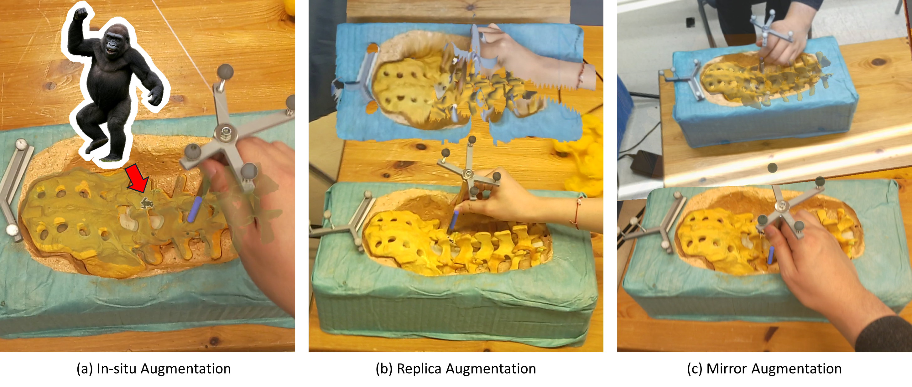
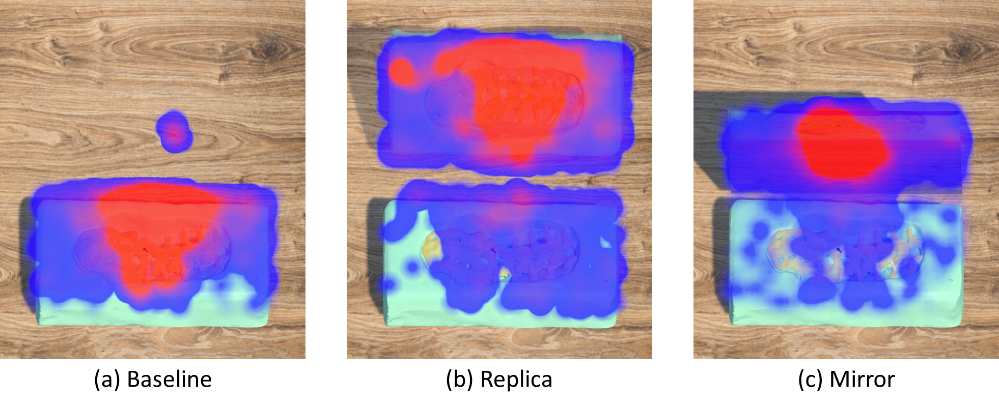
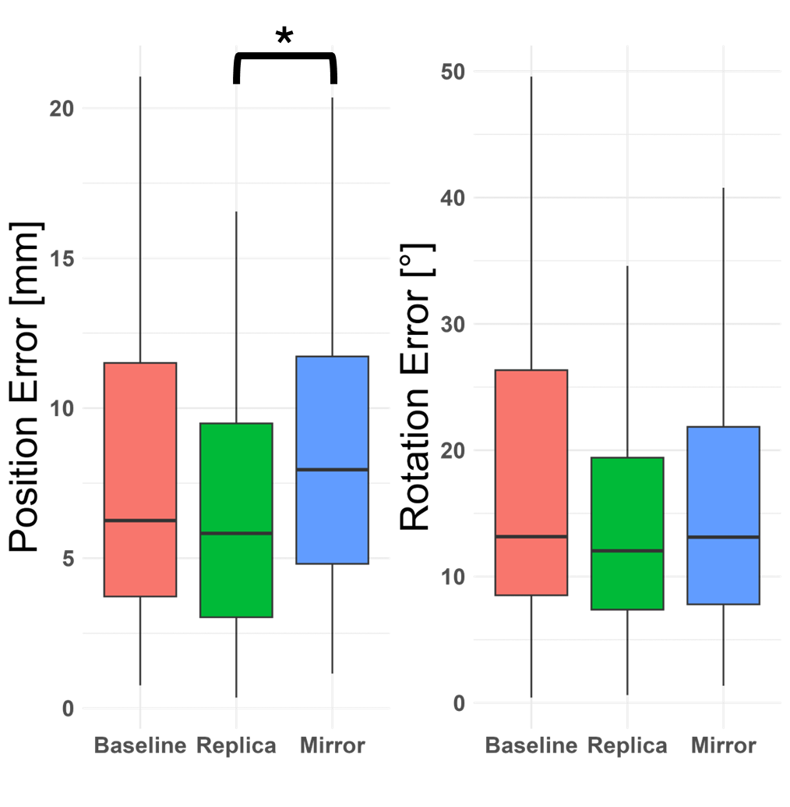

# Ex-Situ Mixed Reality Visualizations for Surgical Guidance


## Overview

This project implements a real-time mixed reality system to support surgical screw placement by visualizing RGB-D point cloud data captured from an Azure Kinect on a HoloLens 2 headset. It features ex-situ visualization through a virtual mirror and point cloud replica, calibrated via STTAR tracking.




## Technologies Used

| Category          | Tools                                                        |
| ----------------- | ------------------------------------------------------------ |
| **Game Engine**   | Unity3D (version 2022.3.5f1)                                 |
| **Hardware**      | Microsoft Azure Kinect, Microsoft HoloLens 2                 |
| **Networking**    | NetMQ                                                        |
| **Calibration**   | STTAR (Spatial Transformation Tracking for Augmented Reality) |
| **Data Analysis** | Python, R                                                    |
| **Eye Tracking**  | MRTK, Unity Eye Gaze APIs                                    |
| **Point Cloud**   | Custom shader & Unity Mesh pipeline                          |


## User Study Results

We conducted a user study with **34 participants** to evaluate user attention and placement performance across three visualization conditions: **Baseline**, **Replica**, and **Mirror**.

### Attention Analysis

We visualized eye-tracking data as heatmaps using Unity to analyze user attention across conditions.



### Performance Analysis

We analyzed log data to evaluate placement performance by comparing absolute position error across conditions using Python and R.

The statistical analysis followed these steps:

1. Checked for normality with the Shapiro-Wilk test, which showed **p < 0.05**, indicating the data were not normally distributed.
2. Tested overall differences between groups using the non-parametric **Kruskal-Wallis test**, which showed a significant difference.
3. Conducted pairwise comparisons with the **Wilcoxon rank-sum test** (Bonferroni-corrected), revealing a significant difference between Replica and Mirror.
4. Assessed statistical equivalence using **two one-sided tests (TOST)**, confirming that Baseline and Mirror were statistically equivalent.

**Summary**:  
- Replica performed significantly better than Mirror.  
- Baseline and Mirror were statistically equivalent.  
- No significant difference was found between Replica and Baseline.




## License and Citation

If you use this project or the library contained within, please cite the following BibTeX entries:

```BibTeX
@misc{keller2023hl2irtracking,
  author =       {Andreas Keller},
  title =        {HoloLens 2 Infrared Retro-Reflector Tracking},
  howpublished = {\url{https://github.com/andreaskeller96/HoloLens2-IRTracking}},
  year =         {2023}
}
```
A. Keller, HoloLens 2 Infrared Retro-Reflector Tracking. https://github.com/andreaskeller96/HoloLens2-IRTracking, 2023. [Online]. Available: https://github.com/andreaskeller96/HoloLens2-IRTracking

```bibtex
@ARTICLE{10021890,
  author={Martin-Gomez, Alejandro and Li, Haowei and Song, Tianyu and Yang, Sheng and Wang, Guangzhi and Ding, Hui and Navab, Nassir and Zhao, Zhe and Armand, Mehran},
  journal={IEEE Transactions on Visualization and Computer Graphics}, 
  title={STTAR: Surgical Tool Tracking using Off-the-Shelf Augmented Reality Head-Mounted Displays}, 
  year={2023},
  volume={},
  number={},
  pages={1-16},
  doi={10.1109/TVCG.2023.3238309}}

```
A. Martin-Gomez et al., “STTAR: Surgical Tool Tracking using Off-the-Shelf Augmented Reality Head-Mounted Displays,” IEEE Transactions on Visualization and Computer Graphics, pp. 1–16, 2023, doi: 10.1109/TVCG.2023.3238309.
